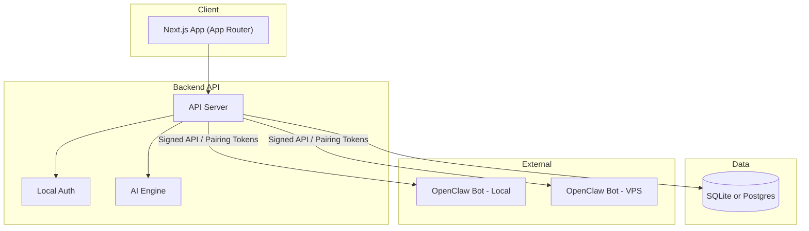
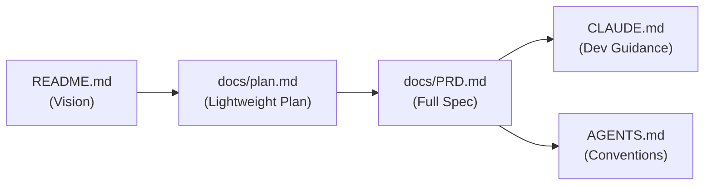
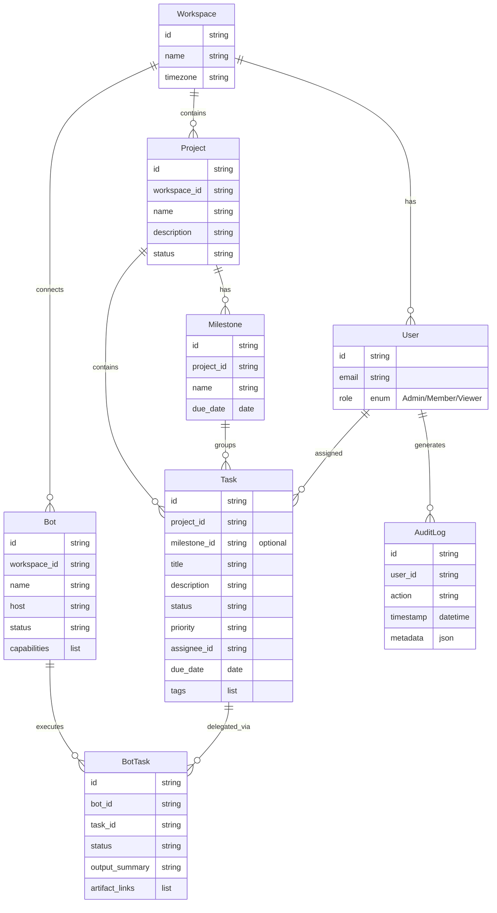
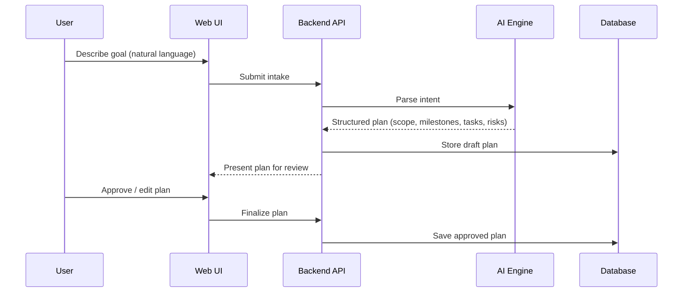
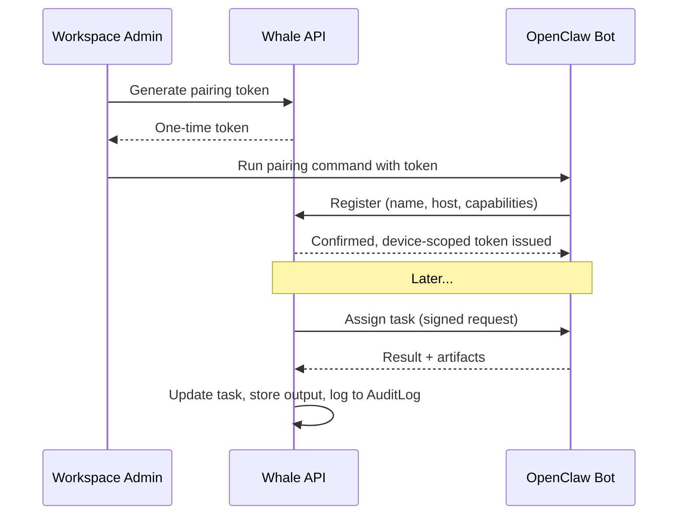

# Codebase Map

> Auto-generated by Cartographer. Last mapped: 2026-02-06T19:32:15Z

## System Overview

Whale is in the **pre-code planning phase** — no application code exists yet. All files are documentation establishing the product vision, requirements, and conventions.

### Proposed Architecture



## Directory Structure

```
whale/
├── AGENTS.md           # Working agreements for AI agents and developers
├── CLAUDE.md           # Guidance for Claude Code sessions
├── README.md           # Project introduction and vision
├── firebase-debug.log  # Firebase CLI exploration artifact (not committed to plan)
└── docs/
    ├── plan.md         # Lightweight planning doc with MVP scope
    └── PRD.md          # Authoritative product requirements document
```

## File Guide

| File | Purpose | Tokens |
|------|---------|--------|
| `README.md` | Project introduction, vision, core user flow, principles | 229 |
| `AGENTS.md` | Working agreements, repo conventions, milestone overview | 150 |
| `CLAUDE.md` | Claude Code guidance: architecture, data model, conventions | 456 |
| `docs/PRD.md` | Full PRD: functional specs, data model, security, milestones | 1,240 |
| `docs/plan.md` | Lighter planning doc with MVP scope and open questions | 301 |
| `firebase-debug.log` | Firebase CLI debug output from exploratory session | 413 |

## Document Relationships



- **README.md** is the entry point; references `docs/plan.md` for details
- **docs/plan.md** is a lighter-weight planning doc that predates the full PRD; mentions Convex as a DB option (not in PRD)
- **docs/PRD.md** is the authoritative spec — all other docs reference or summarize it
- **CLAUDE.md** synthesizes PRD into actionable guidance for Claude Code
- **AGENTS.md** establishes conventions that apply across all contributors

## Data Model



## Core User Flows

### Project Creation



### Bot Pairing & Task Delegation



## Unresolved Decisions

| Decision | Options | Source |
|----------|---------|--------|
| Database | SQLite vs Postgres | PRD.md §12 |
| Backend framework | Convex (plan.md) vs standard API (PRD.md) | plan.md vs PRD.md |
| Firebase? | Debug log suggests exploration, not documented | firebase-debug.log |
| UI surface | Web app, desktop, or both | plan.md |
| Data location | Local-first vs hosted | plan.md |
| Auth strategy | Optional / no login vs required | plan.md |
| Bot protocol | Specific OpenClaw wire protocol TBD | PRD.md §12 |

## MVP Milestones

| Milestone | Scope | Key Deliverables |
|-----------|-------|------------------|
| **M1** | Core Planner | Workspace + project intake, tasks + milestones, daily plan generator, basic UI |
| **M2** | Bot Integration | Pairing flow, task assignment to bots, result collection |
| **M3** | Security | Encryption at rest, audit logs |
| **M4** | Reporting | Daily summaries, activity logs |

## Conventions

- **Docs**: All documentation in `/docs`
- **Commits**: Small, focused, with clear messages
- **APIs**: Typed with explicit schemas
- **Security**: Encrypted secrets, device-scoped tokens, least-privilege, audit logging
- **Change principle**: Every change must improve onboarding clarity or planning velocity
