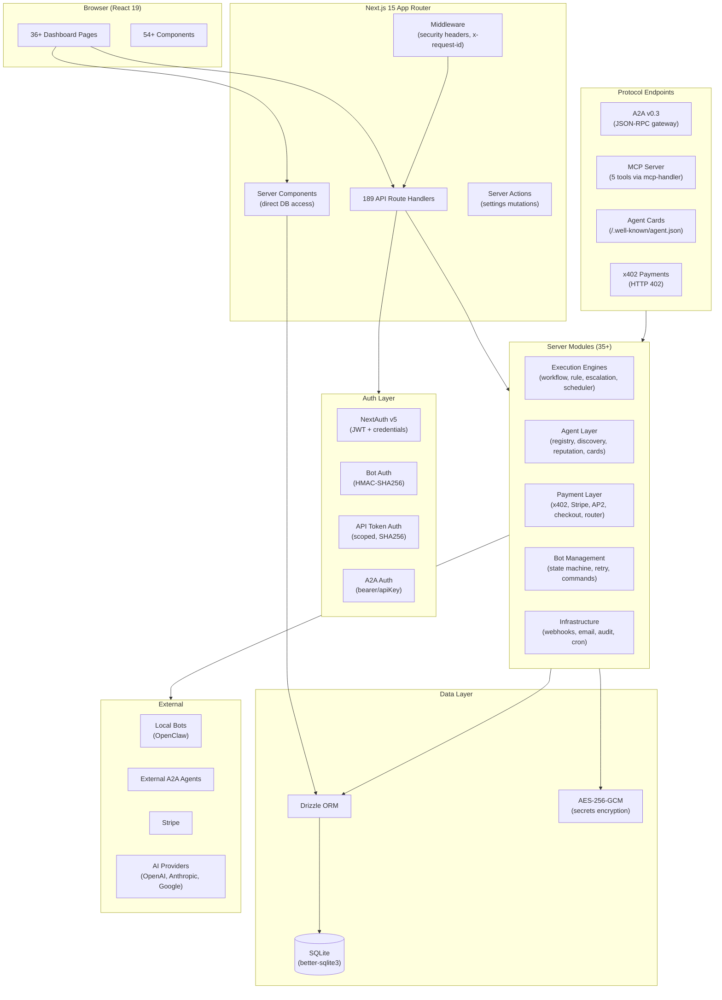
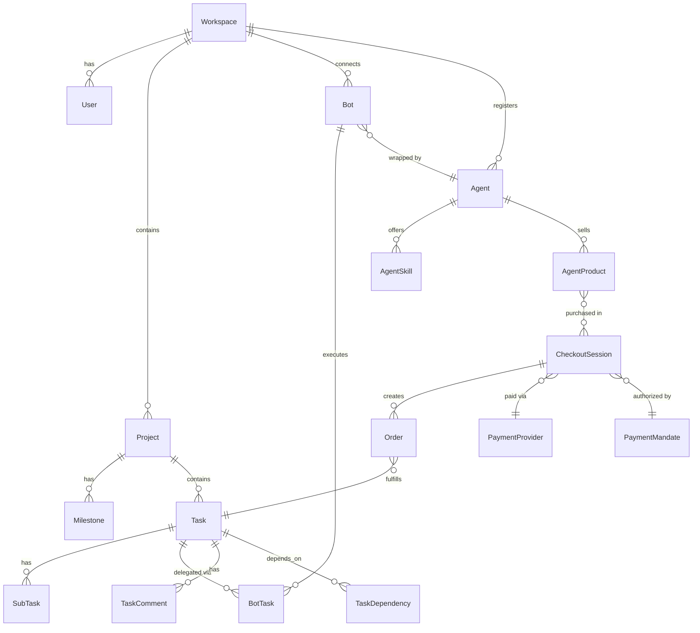

# Codebase Map

> Auto-generated by Cartographer. Last mapped: 2026-02-08T15:04:14Z

## System Overview

Whale is a **self-hosted, AI-first agent orchestration hub** built on Next.js 15 (App Router). It converts natural-language goals into structured plans, delegates work to autonomous agents (local bots or external A2A peers), and settles payments via x402 micropayments or Stripe. SQLite + Drizzle ORM for zero-config local deployment.

**Key stats:** 189 API routes | 85 DB tables | 36+ dashboard pages | 577 tests | 105+ Zod schemas

### Architecture



## Directory Structure

```
whale/
├── src/
│   ├── app/
│   │   ├── (auth)/                    # Login + register (unauthenticated)
│   │   ├── (dashboard)/               # All authenticated routes
│   │   │   ├── dashboard-shell.tsx     # Client wrapper (sidebar + header + main)
│   │   │   └── dashboard/
│   │   │       ├── page.tsx            # Home dashboard
│   │   │       ├── projects/           # Project CRUD + detail + sprints + calendar
│   │   │       ├── bots/               # Bot management + analytics + health
│   │   │       ├── agents/             # Agent registry (A2A)
│   │   │       ├── economy/            # Economy overview
│   │   │       ├── commerce/           # Commerce dashboard + products
│   │   │       ├── negotiations/       # Active A2A negotiations
│   │   │       ├── reports/            # Reporting + cost analytics
│   │   │       ├── team/               # Team workload
│   │   │       ├── settings/           # Settings + tokens + wallet
│   │   │       ├── alerts/             # Predictive alerts
│   │   │       ├── admin/              # Admin tools
│   │   │       └── ...                 # Templates, webhooks, automation, audit
│   │   ├── api/                        # 189 API route handlers
│   │   │   ├── auth/                   # NextAuth + 2FA + sessions + reset
│   │   │   ├── projects/[id]/          # CRUD, tasks, milestones, sprints, calendar
│   │   │   ├── bots/[botId]/           # Lifecycle, tasks, metrics, commands, secrets
│   │   │   ├── agents/                 # Agent registry
│   │   │   ├── a2a/                    # A2A JSON-RPC gateway
│   │   │   ├── mcp/[...rest]/          # MCP server
│   │   │   ├── checkout/               # ACP checkout sessions
│   │   │   ├── products/               # Product catalog
│   │   │   ├── disputes/               # Payment disputes
│   │   │   ├── x402/                   # x402 transactions
│   │   │   ├── payment-providers/      # Payment provider config
│   │   │   ├── ai/                     # 12 AI endpoints
│   │   │   ├── cron/                   # 11 scheduled jobs
│   │   │   ├── workflows/              # DAG workflow orchestration
│   │   │   ├── webhooks/               # Outbound + Stripe webhooks
│   │   │   └── ...                     # Bulk, search, reports, alerts, admin
│   │   └── .well-known/agent.json/     # Hub-level A2A Agent Card
│   │
│   ├── components/
│   │   ├── layout/                     # Sidebar, header, notification bell
│   │   ├── projects/                   # ProjectCard, TaskBoard, BurndownChart
│   │   ├── tasks/                      # TaskCard, QuickAddTask, CommentThread
│   │   ├── bots/                       # BotCard, CommandPanel, ArtifactLinks
│   │   ├── commerce/                   # EconomyOverview
│   │   ├── ai/                         # PlanReview, DailyPlan
│   │   ├── ui/                         # ActivityFeed, GlobalSearch, ThemeToggle
│   │   ├── settings/                   # TwoFactorSetup, SessionsList
│   │   ├── dashboard/                  # ActivityStream
│   │   └── alerts/                     # AlertCard
│   │
│   ├── lib/
│   │   ├── db/
│   │   │   ├── schema.ts              # 85 tables, 2142 lines (Drizzle schema)
│   │   │   ├── index.ts               # Database connection (better-sqlite3)
│   │   │   ├── cursor-pagination.ts   # Cursor-based pagination helpers
│   │   │   └── soft-delete.ts         # Soft-delete query helpers
│   │   ├── server/                     # 35+ server modules (see below)
│   │   ├── auth.ts                     # NextAuth config (credentials + JWT)
│   │   ├── ai.ts                       # AI provider setup (OpenAI/Anthropic/Google)
│   │   ├── validators.ts              # ~105 Zod schemas
│   │   ├── crypto.ts                   # AES-256-GCM encrypt/decrypt
│   │   ├── rate-limit.ts              # In-memory sliding window
│   │   ├── audit.ts                    # logAudit() helper
│   │   └── ...                         # cache, errors, logger, sanitize, env
│   │
│   ├── types/
│   │   ├── a2a.ts                      # A2A v0.3 protocol types
│   │   ├── ap2.ts                      # AP2 mandate types
│   │   ├── index.ts                    # Drizzle-inferred types
│   │   └── next-auth.d.ts             # NextAuth type augmentation
│   │
│   └── __tests__/
│       ├── helpers/setup.ts            # Test DB factory + 20+ entity helpers
│       ├── api/                        # API route tests
│       └── lib/                        # Server module tests
│
├── docs/                               # Documentation
├── public/                             # Static assets
├── scripts/                            # Build/utility scripts
├── vitest.config.ts                    # Test configuration
├── next.config.ts                      # Next.js config
├── drizzle.config.ts                   # Drizzle migration config
└── package.json                        # Dependencies
```

## Database Schema (85 tables)

The schema is organized in layers, each building on the previous:



### Table Domains

| Domain | Tables | Key Tables |
|--------|--------|------------|
| **Core** (projects/tasks) | 12 | `workspaces`, `users`, `projects`, `milestones`, `tasks`, `subtasks`, `taskDependencies`, `taskComments` |
| **Bot management** | 18 | `bots`, `botTasks`, `botLogs`, `botGroups`, `botSecrets`, `botMetrics`, `botCommands`, `botSkills`, `botMemory` |
| **Agent layer** | 4 | `agents`, `agentSkills`, `serviceAgreements`, `agentThreads` |
| **Commerce** | 8 | `agentProducts`, `checkoutSessions`, `orders`, `paymentProviders`, `paymentDisputes`, `x402Prices`, `x402Transactions`, `paymentMandates` |
| **Workflow/automation** | 8 | `workflows`, `workflowRuns`, `workflowRunSteps`, `automationRules`, `escalationRules`, `pipelineTemplates`, `approvalWorkflows` |
| **Observability** | 6 | `auditLogs`, `alerts`, `aiUsageLog`, `costBudgets`, `notifications`, `botMetricRollups` |
| **Team/collab** | 6 | `projectMembers`, `sprints`, `sprintTasks`, `savedViews`, `dashboardWidgets`, `userAvailability` |
| **Security/auth** | 5 | `apiTokens`, `passwordResetTokens`, `userSessions`, `pairingTokens` |
| **Integrations** | 8 | `webhooks`, `webhookDeliveries`, `inboundWebhooks`, `emailQueue`, `githubLinks`, `connectors` |

## Server Modules Guide

### Authentication (7 files)

| Module | Purpose |
|--------|---------|
| `auth-context.ts` | `getAuthContext()` → `{ userId, workspaceId, role }` from NextAuth session |
| `bot-auth.ts` | Bot bearer token + HMAC request signature validation |
| `api-token-auth.ts` | Scoped `whl_*` API tokens with SHA256 hash + wildcard scopes |
| `a2a-auth.ts` | A2A inbound auth (bearer/apiKey, configurable per agent) |
| `cron-auth.ts` | Dual-mode: `CRON_SECRET` header OR admin session |
| `totp.ts` | RFC 6238 TOTP implementation (6 digits, 30s window) |

### Execution Engines (4 files)

| Module | Purpose |
|--------|---------|
| `workflow-engine.ts` | DAG orchestration: parse → topological sort → advance steps → detect cycles |
| `rule-engine.ts` | If-this-then-that: evaluate conditions (eq/neq/gt/lt/contains) → execute actions |
| `escalation-engine.ts` | Failure detection: bot failure spikes, overdue tasks → alerts + notifications |
| `task-scheduler.ts` | Dependency-aware assignment: find ready tasks → match available bots → round-robin |

### Agent Layer (5 files)

| Module | Purpose |
|--------|---------|
| `agent-registry.ts` | Agent CRUD, `createAgentFromBot()`, skill registration, `findAgentsBySkill()` |
| `agent-card.ts` | Build A2A v0.3 Agent Cards from DB (per-agent + hub-level) |
| `agent-task-assignment.ts` | Unified task delegation: local → botTask, external → negotiation |
| `agent-discovery.ts` | Fetch `/.well-known/agent.json`, validate, register external agents |
| `agent-reputation.ts` | Score = 70% completion rate + 30% speed bonus, incremental updates |

### A2A Protocol (3 files)

| Module | Purpose |
|--------|---------|
| `a2a-gateway.ts` | JSON-RPC 2.0 handler: SendMessage, GetTask, CancelTask, ListTasks |
| `sla.ts` | SLA validation + breach detection against service agreements |
| `a2a-auth.ts` | (see Authentication above) |

### Payment Layer (9 files)

| Module | Purpose |
|--------|---------|
| `x402-middleware.ts` | HTTP 402 enforcement: glob-match routes, verify signatures |
| `x402-settlement.ts` | Escrow state machine: authorized → captured → settled / refunded |
| `x402-client.ts` | Auto-pay fetch wrapper for consuming paid external APIs |
| `stripe.ts` | PaymentIntent creation + webhook verification |
| `payment-router.ts` | Provider dispatch: stripe / x402 / manual |
| `checkout.ts` | Checkout session state machine: open → authorized → captured → settled |
| `order-fulfillment.ts` | Order → task conversion: parse line items, find agent, assign |
| `ap2-mandate.ts` | Create + HMAC-SHA256 sign AP2 payment mandates |
| `ap2-verify.ts` | Verify mandate: expiry-first check, then signature validation |

### Infrastructure (8 files)

| Module | Purpose |
|--------|---------|
| `webhook-dispatch.ts` | Fire-and-forget outbound webhooks with HMAC signatures |
| `notify-channel.ts` | Slack/Discord notification delivery |
| `email.ts` | Template rendering + async email queue (SMTP or console) |
| `anomaly-scanner.ts` | Bot health: failure spike detection (>50% in 1hr), stale heartbeats |
| `audit-diff.ts` | Before/after state capture for audit logs |
| `bot-state-machine.ts` | Bot status transitions: offline/idle/working/waiting/error/recovering |
| `bot-task-retry.ts` | Exponential backoff retry (30s * 2^n) |

## API Surface (189 routes)

### Protocol Endpoints

| Endpoint | Protocol | Purpose |
|----------|----------|---------|
| `POST /api/a2a` | A2A v0.3 JSON-RPC | Agent-to-agent task delegation + negotiation |
| `GET /.well-known/agent.json` | A2A | Hub Agent Card (all local skills aggregated) |
| `GET /api/agents/[id]/agent.json` | A2A | Per-agent Agent Card |
| `GET/POST/DELETE /api/mcp/[...rest]` | MCP | 5 tools: list_agents, list_products, create_checkout, get_task_status, discover_agent |
| `POST /api/webhooks/stripe` | Stripe | Payment webhook handler |

### Route Domains

| Domain | Routes | Key Patterns |
|--------|--------|-------------|
| Auth & sessions | ~12 | Register, login, 2FA (setup/verify/disable), sessions, password reset |
| Projects & tasks | ~35 | CRUD + comments, attachments, subtasks, dependencies, time entries, sprints, calendar |
| Bots | ~50 | Lifecycle, tasks, metrics, commands, secrets, memory, skills, groups, fleet |
| Agents | ~5 | Registry CRUD + Agent Card endpoints |
| AI | 12 | generate-plan, decompose, parse-task, estimate-duration, predict-risks, risk-scan, retrospective, bot-advisor |
| Commerce | ~15 | Products, checkout sessions, payment providers, disputes, x402 transactions |
| Automation | ~15 | Workflows, automation rules, escalation rules, pipeline templates |
| Observability | ~15 | Reports, alerts, events (SSE), audit log, cost analytics |
| Cron | 11 | Metrics aggregation, anomaly scan, escalation check, cleanup, retry, reconciliation |
| Utilities | ~20 | Search, bulk ops, templates, views, webhooks, connectors, notifications, tokens, settings |

### Route Handler Pattern

```typescript
export const runtime = "nodejs";

export async function POST(
  req: Request,
  { params }: { params: Promise<{ id: string }> }
) {
  const { id } = await params;                    // Next.js 15: params is Promise
  const ctx = await getAuthContext();              // Auth check
  if (!ctx) return jsonError(401, "Unauthorized");

  const rl = checkRateLimit(`key:${ctx.userId}`, { limit: 10, windowMs: 60_000 });
  if (rl) return jsonError(rl.status, rl.error);  // Rate limiting

  const body = await req.json();
  const parsed = schema.safeParse(body);           // Zod validation
  if (!parsed.success) return jsonError(400, "Validation failed", parsed.error.issues);

  // Business logic...
  logAudit({ workspaceId: ctx.workspaceId, userId: ctx.userId, action: "..." });
  return NextResponse.json({ ... });
}
```

## UI Pages (36+ dashboard pages)

### Navigation Map

```
Dashboard (/)
├── Projects (/projects)
│   ├── List (paginated grid)
│   ├── New (/new) — manual or AI-generated
│   └── [id]
│       ├── Detail (tasks, milestones, burndown, filters)
│       ├── Plan (/plan) — AI daily prioritization
│       ├── Tasks/[taskId] — full task detail
│       ├── Sprints (/sprints) — sprint kanban
│       └── Calendar (/calendar) — date view
├── Bots (/bots)
│   ├── List (grid with status badges)
│   ├── [botId] — detail + activity log
│   │   └── Analytics (/analytics)
│   ├── Health (/health) — fleet overview
│   ├── Releases (/releases) — version management
│   └── Guidelines (/guidelines) — onboarding rules
├── Agents (/agents) — A2A agent registry
├── Economy (/economy) — agentic economy overview
├── Commerce (/commerce)
│   ├── Dashboard — revenue + transactions
│   └── Products (/products) — product catalog
├── Reporting (/reports)
│   ├── Dashboard — completion stats
│   └── Costs (/costs) — AI usage + budget
├── Team (/team) — workload distribution
├── Negotiations (/negotiations) — active A2A negotiations [admin]
├── Alerts (/alerts) — predictive alerts [admin]
├── Users (/users) — user management [admin]
├── Audit Log (/audit-log) — security events [admin]
└── Settings (/settings)
    ├── Workspace, AI provider, profile, 2FA
    ├── Tokens (/tokens) — API token management
    └── Wallet (/wallet) — x402 + Stripe config
```

### Data Flow

- **Server components** (majority): Direct DB queries via Drizzle in `page.tsx` — no API round-trip
- **Client components** (selective): Forms, real-time features, interactive widgets — fetch from API routes
- **Server actions**: Settings page mutations with `revalidatePath()`

## Key Conventions

### Code Patterns
- **Auth**: Always `await getAuthContext()` or `getBotAuthContext(req)` first in route handlers
- **Params**: Next.js 15 `params` is `Promise<{}>` — must `await params`
- **IDs**: UUID text via `crypto.randomUUID()`
- **Timestamps**: Integer milliseconds (`Date.now()`)
- **Soft delete**: `deletedAt` column (nullable integer), filter with `isNull(table.deletedAt)`
- **Audit**: Every mutation calls `logAudit()` with workspace/user/action/metadata
- **Encryption**: `encrypt()`/`decrypt()` from `crypto.ts` for secrets, API keys, payment configs

### Testable Functions
- Server modules accept `db: DbLike` parameter (not singleton import) for in-memory test DBs
- `DbLike = { select: any; insert: any; update: any; delete: any }` — generic enough for Drizzle
- Test helpers in `src/__tests__/helpers/setup.ts`: `createTestDb()` + 20+ entity factories

### Error Response Format
```json
{ "error": "Message", "details": { ... } }
```
Status codes: 400 (validation), 401 (unauth), 403 (forbidden), 404 (not found), 409 (conflict), 429 (rate limit)

## Gotchas & Learnings

| Issue | Solution |
|-------|----------|
| `import "server-only"` breaks Vitest | Don't use it; `src/lib/server/` path convention is sufficient |
| Agent-spawned `DbLike` too narrow | Use `{ select: any; ... }` not `(...args: unknown[]) => unknown` |
| `Date.now()` in server components | Triggers react-hooks/purity lint — use `sql\`strftime('%s','now') * 1000\`` |
| `drizzle-kit push` is interactive | Use `--force` flag or direct `sqlite3` with `PRAGMA foreign_keys=OFF` |
| `pnpm build` fetches Google Fonts | Fails in sandboxed environments — use `tsc --noEmit` instead |
| NODE_MODULE_VERSION mismatch | Run `pnpm rebuild better-sqlite3` after Node version changes |
| AP2 mandate tests need secret | Set `NEXTAUTH_SECRET` in vitest.config.ts `test.env` |
| AP2 verification order | Check expiry BEFORE signature — fail fast on stale mandates |
| `tasks.projectId` is nullable | A2A/ACP inbound work exists at workspace level without projects |

## Protocol Stack

| Layer | Standard | What It Does |
|-------|----------|-------------|
| Identity | A2A Agent Cards | Agent discovery, capability advertising |
| Collaboration | A2A v0.3 JSON-RPC | Task delegation, negotiation, state management |
| Commerce | ACP (REST + MCP) | Product catalog, checkout sessions, order fulfillment |
| Authorization | AP2 Mandates | HMAC-SHA256 signed payment authorization |
| Payments (fiat) | Stripe | Credit card / bank transfer settlement |
| Payments (crypto) | x402 | HTTP-native USDC micropayments (Base network) |
| Tools | MCP via mcp-handler | Expose capabilities as LLM-consumable tools |

## Dependencies

### Core Stack
- Next.js 16.1.6, React 19, TypeScript
- Drizzle ORM 0.45.1 + better-sqlite3 12.6.2
- NextAuth 5.0.0-beta.30
- Vercel AI SDK 6.0.73 (@ai-sdk/openai, @ai-sdk/anthropic, @ai-sdk/google)
- Zod 4.3.6, Tailwind CSS v4

### Agentic Economy
- @modelcontextprotocol/sdk 1.26.0 + mcp-handler 1.0.7
- @x402/core, @x402/evm, @x402/next 2.3.0
- Stripe 20.3.1

### Testing
- Vitest 4.0.18

## Environment Variables

| Variable | Purpose | Required |
|----------|---------|----------|
| `NEXTAUTH_SECRET` | JWT signing + HMAC signing | Yes |
| `NEXTAUTH_URL` | Auth redirect base URL | Yes |
| `ENCRYPTION_KEY` | 64-char hex for AES-256-GCM | Recommended |
| `OPENAI_API_KEY` / `ANTHROPIC_API_KEY` / `GOOGLE_API_KEY` | AI provider (one required) | Yes (one) |
| `STRIPE_SECRET_KEY` | Stripe payments | If using Stripe |
| `STRIPE_WEBHOOK_SECRET` | Stripe webhook verification | If using Stripe |
| `X402_FACILITATOR_URL` | x402 facilitator endpoint | If using x402 |
| `X402_WALLET_ADDRESS` | Public wallet address | If using x402 |
| `X402_WALLET_PRIVATE_KEY` | EVM wallet for payments | If using x402 |
| `CRON_SECRET` | Cron job auth | Recommended |
| `SMTP_HOST` / `SMTP_PORT` | Email sending | Optional |
